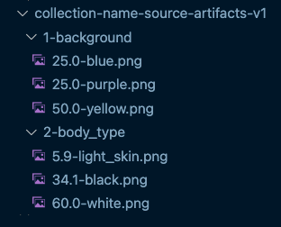
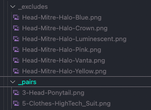

# Artwork Spec

For this script to correclty generate your art we will need your designers to follow a very specific file/folder convention so that it works with the generation tool.

## Valid Structure Example

## The Rules

- No spaces or special characters in any folder or file name. Only alpha numeric with `-` to seperate values and `_` to act as a space. Capitals are okay.
- Layers are seperated by folders and the folder names should be prefixed with order values, ie: `1-` will be placed on the canvas before `2-`.
- Files within a layer/folder should be prefixed with their weight value `25.0-` means there is a 25% chance that trait will be selected during random generation. All values within a layer/folder should add up to 100.
- Weight values should not contain leading zeros ie: `02.5` is not valid but `2.5` is valid.

## Special Condition Folders

These special folders are usually not needed so unless you know you need them you can just ignore this section.

`\_pairs`, `\_exclude`, `\_includes` allows you to creating special conditions for layers.

For `\_pairs` if there is an attribute that when applied needs another image to show up on a different layer you can specify that with: OtherLayerIndex-PairCategory-PairValue.

For `\_exclude`s if you do not want one attribute to show up with another because they conflict then you can use this format: CategoryA-ValueA-CategoryB-ValueB.png. The actual content of this file doesn’t matter the script just uses the name of the file to determine what to do. I like to copy the conflicting image into this folder and rename it just as a visual reference.

For `\_includes` if you only want certain traits to show up when an earlier trait has been selected you can use this format CategoryA-ValueA-CategoryB-ValueB.png. (still needs to be implemented)
